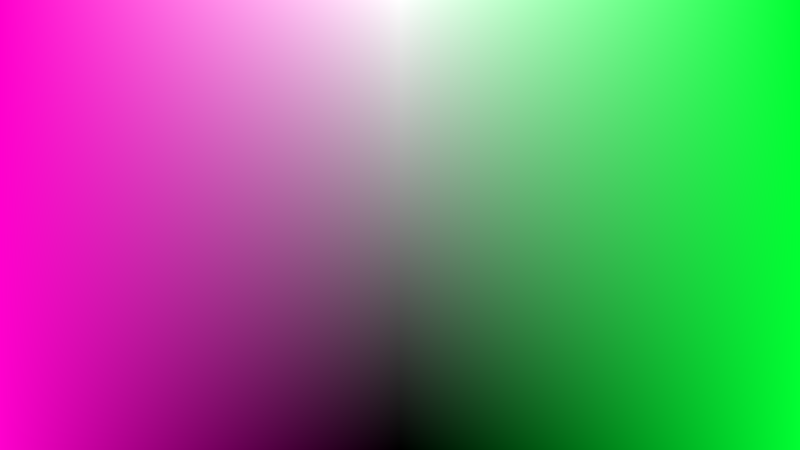

# HCG (color model)
> Color model [HCG](https://github.com/acterhd/hcg-color/blob/master/convert/hcg.js) is an alternative to [HSV and HSL](https://en.wikipedia.org/wiki/HSL_and_HSV), derived by Munsell color system.

## HCG (Article)

### Description
This color model invented in 2015. This color model is a 3 channel: H, C, and G. This color model is changing mixed gray color, instead of changing the brightness (luminance). This differs from the other color models, such as HSV and HSL.

### Behavior
Color model HCG has its own behavior. When you change the second channel (chroma), hue is mixed with a selected shade of gray (third channel). In this regard, there are some features in the conversion of RGB. If the C channel is set to 1, the G channel becomes undefined. If channel C is set to 0, the hue channel H is undefined. In this connection, RGB value must be chosen so that it was not a fully chromatic, nor completely achromatic.

### Motivation
This color model is set up to complement the set of color models such as HSB and HSL (and some other). This color model also reveals the essence of the color models, such as the value of the chroma. This color model solves the question: what kind of gray are mixed in the selected color shade, and how.

### Visualization
 

Figure 1. HCG diagram and visual shader

Color model HCG has shades of gray in the middle, while the hue shades are not shaded at the edges of the cylinder (like HSV). This means that the HCG relies still on the hue. This is useful when you want to change the mixed shade of gray, without changing the value saturation.

### Simple conversion between HCG and RGB

The whole algorithm for obtaining RGB color that is similar to the mixed hue (pure RGB) with a shade of gray, as the blending coefficient used chroma. The expression `G * (1 - C)` is the minimum value of RGB, and the value of channel C (chroma) is the delta of the minimum and maximum values of RGB. For these and crosstalk can find the inverse of H, C and G of RGB.

```
# From
hcg2rgb [h<6..0>, c<1..0>, gr<1..0>]
    pure_rgb<0..1, 0..1, 0..1> = rgb_from_hue(h)
    m<0..1> = gr * (1 - c)
    return [pure_rgb * c + m]

# To
rgb2hcg [r<1..0>, g<1..0>, b<1..0>]
    M<0..1> = max(r, g, b)
    m<0..1> = min(r, g, b)
    c<0..1> = M - m
    h<0..6> = c > 0 ? hue_from_rgb(r, g, b) : 0
    g<0..1> = c < 1 ? m / (1 - c) : 0
    return [h, c, g]
```

### Conclusion
This color model is fairly easy to learn, easy to implement and has a variety of applications. For example a color picker, or editing graphics. It may also help in the virtual vision.

### Reference
-	HSL and HSV (https://en.wikipedia.org/wiki/HSL_and_HSV)
-	Munsell color model (https://en.wikipedia.org/wiki/Munsell_color_system)
-	Github repository (https://github.com/acterhd/hcg-color)


----------
## HCG (implementation)

### Implementation

+ Death color by acterhd https://github.com/acterhd/death-color
+ Low-level library, visualizer https://github.com/acterhd/color-nuker
+ Converter https://github.com/scijs/color-space
+ Converter https://github.com/Qix-/color-convert
+ Plugin for D3 https://github.com/d3/d3-hcg
+ Converter https://github.com/satya164/pigment
+ Plug-in for Less https://github.com/acterhd/less-hcg
+ Atom Editor (plugin) https://github.com/abe33/atom-pigments
+ HCG shade behavior like https://jsfiddle.net/3n1gm4/2yx6xLp9/

### Demonstration and calculators

+ Visualized [HCG cylinder](https://plot.ly/~acterhd/8/)
+ Shadertoy visual demo of [HCG](https://www.shadertoy.com/view/ltSXRV), [HSL](https://www.shadertoy.com/view/XtjXRK), [HSV](https://www.shadertoy.com/view/4dVXDd), [Color Picker](https://www.shadertoy.com/view/ldK3Wh)
+ Color picker https://acterhd.github.io/color-picker/ (coming soon)

### Publications

+ acterhd blog post (RUS) http://acterhd-blog.blogspot.ru/2016/07/blog-post.html

----------

## Contributors and thanks

- acterhd (acterhd@gmail.com) - Author


> Repository made by acterhd in 2015 - 2016 years.
