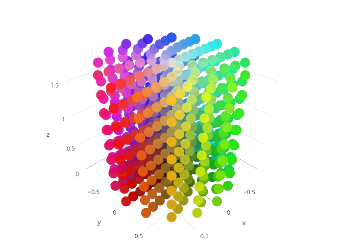

# HCG (color model)
> Color model [HCG](https://github.com/acterhd/hcg-color/blob/master/convert/hcg.js) is an alternative to [HSV and HSL](https://en.wikipedia.org/wiki/HSL_and_HSV), derived by Munsell color system.


## Revision for 2020 

I found new use cases for HCG in 2020 years... I will also provide corrections and descriptions. 


### Inverse your RGB color...

Normal RGB equal normal HCG conversion i.e. `H % 360deg, C (between 0.0 and 1.0), G (between 0.0 and 1.0)`.
But invert RGB equal to `(H + 180deg) % 360deg, C, 1.0 - G`. 
Why? Because minimal value of RGB inverts into maximal, maximal value of RGB inverts into minimal, but Chroma doesn't changing... 
About 180deg rotate, currently I don't want give any mathematical proof, but there is has known facts from internets (for example, here https://stackoverflow.com/questions/1165107/how-do-i-invert-a-colour). 


### Dark and light theme

When I watch that or such video (https://www.youtube.com/watch?v=qimopjP6YoM), I understand that HCG color space can be used for dark and light themes themes. The point is that HCG reference values can allow you to make correct dark and light themes, using offsets in the "G" channel. The higher, the lighter, and vice versa. In this case, the colored parts of the site will remain colored or close to that. 

```scss
.dark-theme {
  filter: invert(100%) hue-rotate(180deg);
  color: rgb(0, 0, 127);
  //color: rgb(127, 127, 255);
}

.light-theme {
  color: rgb(0, 0, 127);
}
```

Can be represented as... 

```scss
.light-theme {
  $mod: 0; /* dark font */
  color: hcg(240, 50, $mod);
}

.dark-theme {
  $mod: 100; /* light font */
  color: hcg(240, 50, $mod);
}
```

The HCG color model can play a key role in such dark and light themes as in a twitter post (https://twitter.com/steveschoger/status/1151160261170126850). 

## HCG (Article)

### Description
HCG - is HSV/HSL based color model. This color model use 3 channel: H, C, and G. Changing mixed gray color, instead of changing the brightness (luminance). This differs from the other color models, such as HSV and HSL.

### Behavior
The HCG color model is a relatively new color model standing next to RGB, HSV, HSL or HWB. It has its own distinctive features. The color model is represented by the mixing ratio of "H" (hue) and "G" (grayscale), where chromaticity depends on the "C" (chroma) channel. And how much higher the "C" value (chroma) is, so closer the color is to the pure value of hue. Lower "C" (chroma) values make the color gray and depend on the "G" channel. Unlike HSV, a color at a high "C" (chroma) value does not become black when the last channel (aka "G" channel) decreases, but changes only the mixed dominance value (e.g. whitish becomes darker and colored remains colored). There is also a difference from HSL where changing the "G" channel affects only grey tint, while hue and mixing ratio (channel "C", chroma) are preserved. However, conversion from RGB has its limitations. For example, absolutely chromatic values do not allow calculating the "G" channel (grayscale). Conversely, grayscale values (when R = G = B) do not allow to calculate "H" (hue).    

### Visualization


Figure 1. HCG diagram and visual shader

Color model HCG has shades of gray in the middle, while the hue shades are not shaded at the edges of the cylinder (like HSV). This means that the HCG relies still on the hue. This is useful when you want to change the mixed shade of gray, without changing the value saturation.

### Simple conversion between HCG and RGB
The whole algorithm for obtaining RGB color that is similar to the mixed hue (pure RGB) with a shade of gray, as the blending coefficient used chroma. The expression `G * (1 - C)` is the minimum value of RGB, and the value of channel C (chroma) is the delta of the minimum and maximum values of RGB. For these and crosstalk can find the inverse of H, C and G of RGB. The full version of conversion from HCG to RGB and back is presented in `convert/index.js` file. Some simplifications have also been made. 

### More color model conversions 

There presented NOT all color models conversions, but in general I was presented. 
- https://github.com/helixd2s/hollow-color (author-made)
- https://github.com/helixd2s/hcg-color/blob/master/convert/index.js (original)
- https://github.com/Qix-/color-convert/blob/master/conversions.js (color-convert)
- https://github.com/colorjs/color-space/blob/master/hcg.js (color-space by colorjs)


### Conclusion
This color model is fairly easy to learn, easy to implement and has a variety of applications. For example a color picker, or editing graphics. It may also help in the virtual vision.

### Reference
-	HSL and HSV (https://en.wikipedia.org/wiki/HSL_and_HSV)
-	Munsell color model (https://en.wikipedia.org/wiki/Munsell_color_system)
-	Github repository (https://github.com/acterhd/hcg-color)

